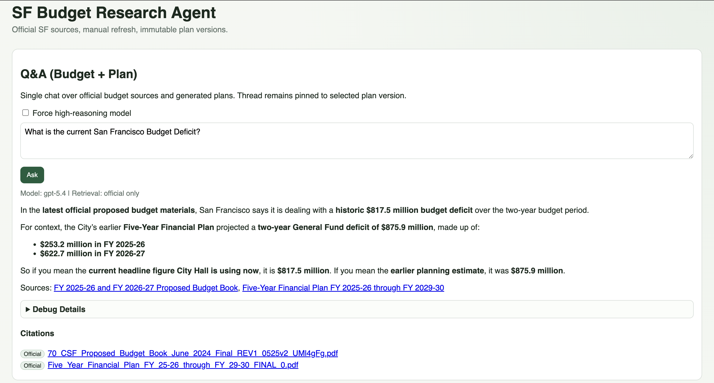

# SF Budget Research Agent (v1)



Local-first web app that:
- Discovers official SF budget sources from HTML seed pages and ingests linked PDF/XLSX assets
- Supports unified Q&A across official budget docs

In Progress:
- Generates an immutable plan version in Lurie-style section format
- Builds department-level comparisons against mayor proposal signals
- Exports memo PDF and comparison CSV

## Setup

```bash
python3.11 -m venv .venv
source .venv/bin/activate
pip install -U pip
pip install -r requirements.txt
cp .env.example .env
```

Set `OPENAI_API_KEY` and `COHERE_API_KEY` in `.env`.

## Run App

```bash
source .venv/bin/activate
python run_app.py
```

Open: `http://127.0.0.1:8000`

## UX Workflow

1. Click **Refresh Sources** (manual only)
2. Ask questions in **Q&A** over official budget evidence
3. **(Beta)** Click **Generate New Plan** (creates immutable version)
4. **(Beta)** Review **Plan View** and **Comparison View**
5. **(Beta)** Export with **Download Memo PDF** and **Download Comparison CSV**

## API Endpoints

- `POST /ingest/run`
- `GET /sources`
- `POST /plans/generate`
- `GET /plans`
- `GET /plans/{plan_id}`
- `GET /plans/{plan_id}/comparison`
- `POST /plans/{plan_id}/chat`
- `GET /plans/{plan_id}/export/pdf`
- `GET /plans/{plan_id}/comparison/export/csv`

## Model Routing

- Plan generation/comparison: `gpt-5.4` with high reasoning
- Routine Q&A: `gpt-5.4-mini`
- Optional escalation in Q&A for complex prompts

Q&A retrieval guardrail:
- Default: retrieve from `official` SF sources only
- If user explicitly asks about the generated/proposed plan: include `plan` sources
- HTML seed pages are discovery-only; they are not chunked or returned by retrieval.

Cohere reranking:
- Retrieval first selects the top `8` chunks by embedding similarity.
- Cohere reranks those candidates and returns the reranked top `8` chunks to the answer generator.
- Set `COHERE_API_KEY` in `.env`.
- Candidate pool is controlled by `RAG_RERANK_CANDIDATE_POOL` (default `8`).
- Final returned chunks are controlled by `RAG_RETRIEVER_K` (default `8`).
- Rerank model is controlled by `RAG_RERANK_MODEL` (default `rerank-v4.0-pro`).

## Q&A Evaluation Suite

Local-only evals for the Q&A feature live in `evals/`. The initial suite uses official SF budget sources only; generated plan cases are intentionally excluded from v1. A selected plan is still resolved because the current Q&A service requires one, but every initial case expects `official` retrieval only and forbids `plan://` citations. Gold retrieval/citation labels target chunked non-HTML documents because HTML seed pages are discovery-only.

Run the full suite:

```bash
.venv/bin/python evals/run_qa_eval.py --cases evals/qa_cases.yml
```

Useful options:

```bash
.venv/bin/python evals/run_qa_eval.py \
  --cases evals/qa_cases.yml \
  --trials 3 \
  --threshold 0.7 \
  --critical-floor 0.5
```

- `--trials N` runs each case multiple times and aggregates scores.
- `--limit N` runs only the first `N` cases for smoke/debug runs; limited runs are marked non-authoritative in the output.
- `--threshold` is the minimum mean LLM rubric score for a case to pass.
- `--critical-floor` fails a case if any trial falls below that rubric score.

Multiple-trial runs report:

- `pass@k`: fraction of cases where at least one of `k` trials passed.
- `pass^k`: fraction of cases where all `k` trials passed.
- `trial_pass_rate`: fraction of individual trials that passed.

Each run writes local artifacts under `eval_results/<run_id>/`:

- `summary.json`
- `summary.md`
- `traces/<case_id>/trial_<n>.json`

Traces include retrieval policy, retrieved chunks, prompt/messages, parsed answer, citations, response blocks, reasoning summaries when provided, tool calls if present, deterministic grader output, and LLM judge scores/rationales. The runner also writes `eval_results/latest_run.txt`.

The suite uses deterministic graders plus LLM rubric graders inspired by LangSmith RAG evaluation concepts, but v1 does not publish datasets or experiments to LangSmith.

The deterministic graders focus on retrieval policy, retrieval quality, citations, forbidden generated-plan references, non-empty answers, non-empty retrieval, and scored support for numeric/date claims. The initial suite labels relevant source-document IDs and reports recall@k, precision@k, and MRR. Every citation must point to a document that was actually retrieved. If the answer includes money amounts, percentages, fiscal years, or dates, those claims are canonicalized and scored against claims found in the retrieved context; this numeric/date support grader is non-blocking and acts as a warning. Completeness and wording are handled by the LLM rubric graders rather than brittle required-phrase checks.

## Notes

- Manual refresh + manual regenerate by design
- No startup auto-refresh and no auto-regenerate
- Persistence is SQLite by default (`research_agent.db`)
